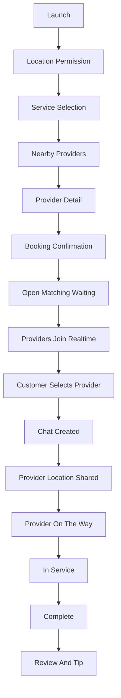
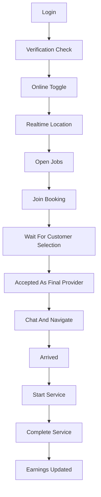

# UX Flow Map

## Phase 1 Navigation Shape

Customer app uses five tabs:

- Home: location, service categories, nearby providers
- Providers: searchable provider list and provider profile
- Bookings: active booking, matching, history
- Chat: rooms and messages
- Profile: account, addresses, wallet, support

Provider app uses five tabs:

- Requests: open matching jobs and invitations
- Schedule: availability and upcoming services
- Earnings: payouts, completed jobs, tips
- Chat: customer conversations
- Profile: verification, services, online toggle

Admin web uses sidebar navigation:

- Dashboard
- Customers
- Providers
- Verification
- Bookings
- Matching
- Payments
- Reviews/Reports
- Coupons
- Analytics
- Audit Log

## Customer Booking Sequence

## Provider Sequence

## UX Comparison Principles

- Preserve: onboarding/auth/location prompts, tab-based IA, service/provider browsing before booking, booking detail/status timeline, chat placement, provider verification sequence.
- Change: original branding, artwork, copy, colors, icons, and payment/provider matching mechanics.
- Improve: make matching explicit and anxiety-reducing with visible provider participants and clear timeout/refund states.

